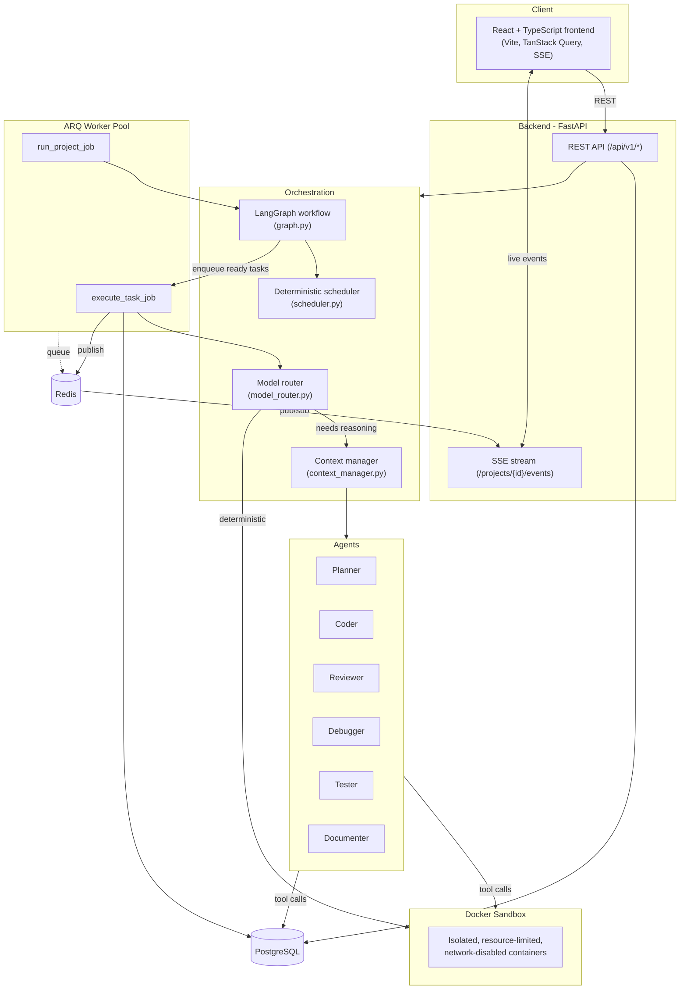
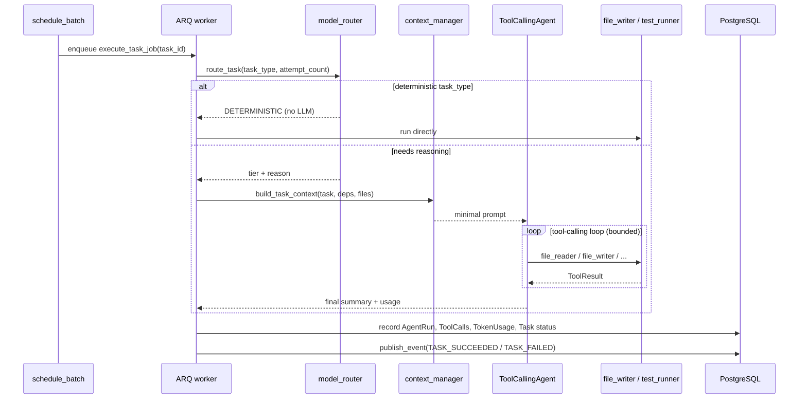

# 02 - Architecture

## System diagram

## Component responsibilities

**FastAPI backend** (`backend/app/api`) - thin REST layer: auth, CRUD for
projects/tasks/files/approvals, metrics queries, and the SSE stream. Contains no
orchestration logic itself; every non-trivial handler delegates to `app/services`.

**Orchestrator** (`backend/app/orchestrator`) - the decision-making core. See
[04-orchestrator.md](04-orchestrator.md) for the full breakdown of what lives where and why.

**Agents** (`backend/app/agents`) - six thin configurations (system prompt + tool set +
model tier) of one shared ReAct-style tool-calling loop (`agents/base.py`). See
[09-agent-design.md](09-agent-design.md).

**Tools** (`backend/app/tools`) - the only way an agent affects the world. Split into
DB-backed tools (file read/write/search - safe, no execution) and sandbox-backed tools
(test/lint/format/shell - always run inside Docker). See [10-tool-system.md](10-tool-system.md).

**Worker pool** (`backend/app/workers`, ARQ) - runs `execute_task_job` (one task,
end-to-end) and `run_project_job` (drives a `ProjectRunner` through the graph) outside the
request/response cycle. See [17-worker-system.md](17-worker-system.md).

**Sandbox** (`backend/app/sandbox`, `docker/sandbox.Dockerfile`) - isolated execution for
anything that runs generated code. See [11-code-execution-sandbox.md](11-code-execution-sandbox.md).

**Frontend** (`frontend/`) - React + TypeScript + Vite. See [16-frontend.md](16-frontend.md).

## Data flow for one task

## Why this shape

The two things that make this "genuinely agentic" rather than a scripted pipeline are (1)
the graph's conditional routing genuinely branches on runtime state - a project with no
failures never visits `handle_failures`; a project with a clean build never revisits it
after tests pass once - and (2) tasks are dispatched as a real concurrent batch to a real
worker pool, not simulated with `asyncio.sleep`. See [23-design-decisions.md](23-design-decisions.md)
for the alternatives that were considered and rejected.
