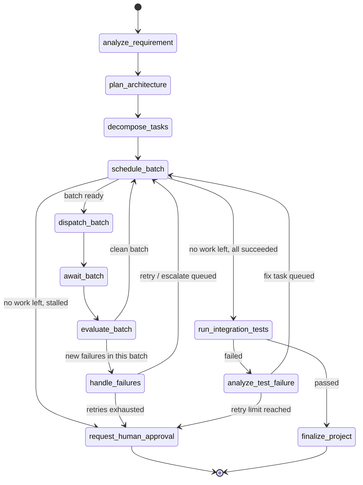

# 03 - The Agentic Workflow

## The graph

## Why this is not a linear pipeline

`schedule_batch` is revisited every time a batch of tasks resolves - for a project with N
tasks and a concurrency cap of C, it is visited roughly `ceil(N/C) + 1` times in the happy
path alone (the "+1" is the call that discovers there is nothing left to schedule and
routes onward - see the trace assertions in
`backend/tests/integration/test_orchestrator_graph.py`). Every failure adds more visits.
There are five conditional-routing decision points, each a plain Python function
inspecting real state (`app/orchestrator/graph.py::route_after_*`), not a fixed sequence.

## What makes this genuinely agentic, concretely

- **Autonomous decision-making**: the orchestrator decides *whether* a task needs an LLM,
  *which* model tier, and *whether* to retry/escalate/ask-a-human - without a human in the
  loop for any of those decisions (a human is only pulled in when the deterministic policy
  itself decides to ask).
- **Real state, not conversation replay**: nothing about "what happens next" is inferred
  from a chat transcript. It comes from querying `tasks`, `errors`, and `test_runs` in
  Postgres (see [14-database-design.md](14-database-design.md)).
- **Tool usage, not hallucinated actions**: a Coding agent that "writes a file" has
  actually called `file_writer`, which has actually inserted a row into `files` - see
  [10-tool-system.md](10-tool-system.md).
- **Real feedback loops**: `run_integration_tests` -> `analyze_test_failure` ->
  (a real Debug-agent-authored fix, dispatched through the same scheduler as any other
  task) -> `run_integration_tests` again is a genuine loop with a real exit condition
  (pass, or retry-limit-exhausted).
- **Verification before declaring success**: `finalize_project` is only reachable through
  `run_integration_tests` reporting `passed` - there is no path from `decompose_tasks` to
  `finalize_project` that skips testing.

## What is deliberately NOT agentic

Scheduling, routing, and recovery-policy decisions are deterministic Python, not agent
calls (see [04-orchestrator.md](04-orchestrator.md)'s decision table). This is a design
choice, not a limitation - see [23-design-decisions.md](23-design-decisions.md), "why the
orchestrator itself doesn't call an LLM."
