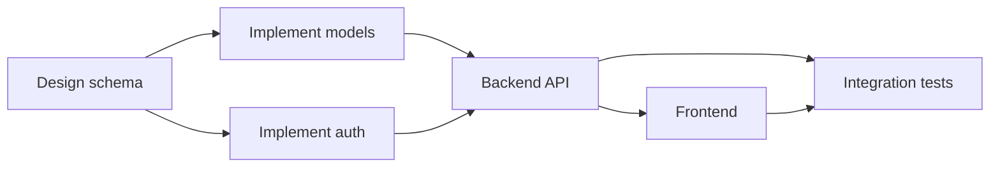

# 05 - Task DAG

## Representation

Tasks are rows in `tasks`; edges are rows in `task_dependencies` (`task_id`,
`depends_on_task_id`). The Planner proposes the graph as JSON (a flat list of
`{key, depends_on: [...]}` objects using its own local keys like `"T1"`); before anything
is written to the database, `app/orchestrator/scheduler.py::validate_dag` runs a full
topological sort (Kahn's algorithm) and rejects the proposal if it contains a cycle or a
dependency on an unknown key. A rejected proposal surfaces as a `PlannerOutputError`,
which the retry policy treats like any other task-level failure.

## Scheduling algorithm

`get_ready_tasks(tasks, running_count, max_parallel)`:

1. A task is a *candidate* if its status is `pending`/`ready` and every task it
   `depends_on` has status `completed` or `skipped`.
2. Candidates are sorted by `(priority desc, id asc)` for deterministic ordering.
3. The result is capped at `max_parallel - running_count`.

This is a pure function over a list of `TaskNode(id, status, depends_on, priority)` value
objects - no database, no async, no LLM. See `backend/tests/unit/test_scheduler.py` for
the full behavioural contract, including the two properties that matter most for
correctness:

- **`is_project_complete` requires every task to have *succeeded*** (`completed` or
  `skipped`) - a task that is `failed` or `blocked` does NOT count as "complete", even
  though the scheduler has nothing left to dispatch for it. Conflating the two was an
  actual bug caught during development (see [23-design-decisions.md](23-design-decisions.md),
  "the `is_project_complete` / `is_stalled` split") - it would have routed a broken build
  straight into "run the integration tests" as if nothing were wrong.
- **`is_stalled` is the deadlock signal**: nothing running, nothing ready, and the project
  did not complete successfully. This is what routes to human escalation instead of
  silently declaring victory or hanging forever.

## Parallelism

Independent tasks (no dependency relationship between them, either direction) are
dispatched in the same batch, up to `MAX_PARALLEL_TASKS` (env-configurable). Real
concurrency comes from the ARQ worker pool picking up multiple `execute_task_job`
invocations at once - the scheduler only decides *which* tasks are eligible, it does not
run them.

## Failure propagation

When a task's status becomes terminally `failed` (retries exhausted, no human override
yet), `get_newly_blocked_tasks` finds every downstream task that depends on it (directly
or transitively, since a blocked task is itself excluded from `dependencies_satisfied`)
and flips it to `blocked`. This runs at the start of every `schedule_batch` call, so the
UI's task graph reflects blocked-ness within one scheduling cycle of the upstream failure.
