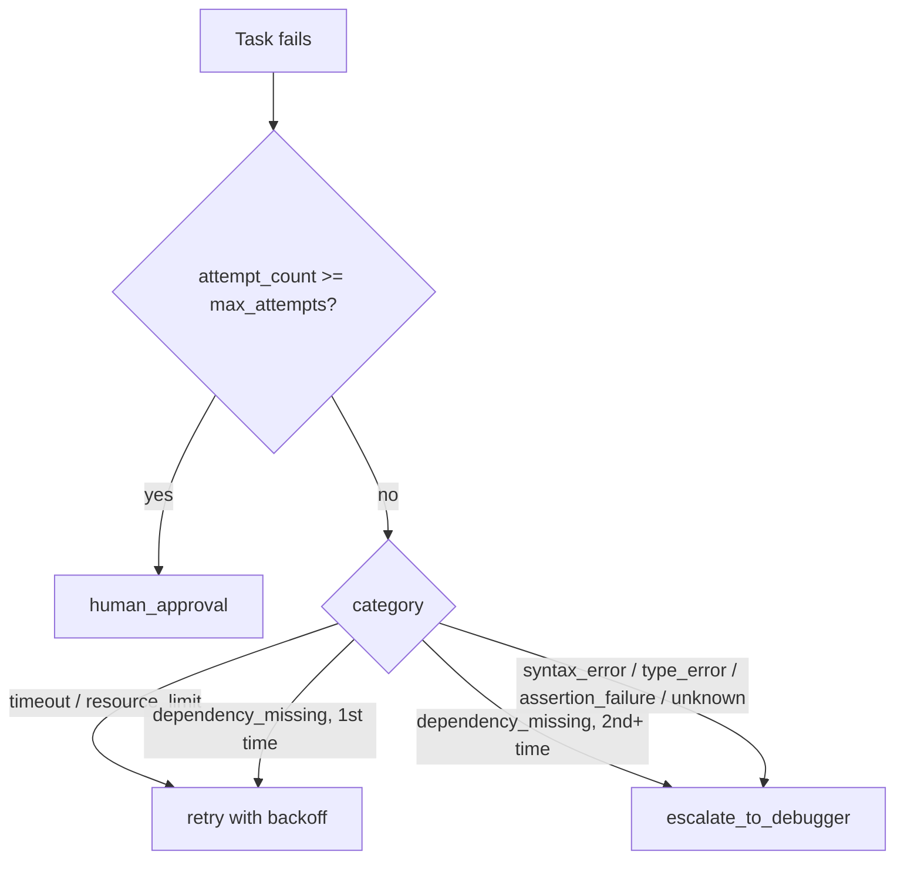

# 12 - Failure Recovery

## Two deterministic decisions, zero LLM calls

`app/orchestrator/failure_recovery.py` makes two decisions, both pattern-matching /
lookup-table logic:

1. **`classify_error(message) -> ErrorCategory`** - ordered regex patterns
   (dependency-missing checked before generic import-error, so a missing third-party
   package isn't misclassified as an internal bug) sort a raw error message into one of:
   `syntax_error`, `import_error`, `type_error`, `assertion_failure`, `timeout`,
   `dependency_missing`, `resource_limit`, `tool_error`, `unknown`.
2. **`decide_recovery(category, attempt_count, max_attempts) -> RecoveryDecision`** -
   `retry` (with exponential backoff), `escalate_to_debugger`, or `human_approval`.

## The policy

The key rule: **a code-level error (syntax, type, assertion) never gets a blind retry.**
Retrying identical generated code without diagnosis is exactly the infinite-retry-loop
anti-pattern the project brief calls out - so those categories go straight to the Debug
agent, which receives the specific error via the context manager
([06-context-engineering.md](06-context-engineering.md)) and is expected to diagnose
before changing anything. Only genuinely transient categories (timeout, resource limit)
get a same-attempt retry, and a "maybe transient" category (a missing dependency) gets
exactly one retry before also escalating.

`compute_backoff(attempt_number, base, max)` is `base * 2^(attempt-1)`, capped at
`RETRY_BACKOFF_MAX_SECONDS` - standard exponential backoff, verified in
`backend/tests/unit/test_failure_recovery.py` to be non-decreasing and to actually hit the
cap given enough attempts.

## Where this plugs into the graph

`ProjectRunner.handle_failures` (a graph node - see
[04-orchestrator.md](04-orchestrator.md)) applies `decide_recovery` to every task that
failed in the just-completed batch: `retry` resets the task to `PENDING` (picked up by the
next `schedule_batch` cycle); `escalate_to_debugger` does the same but also switches
`assigned_agent_type` to `DEBUGGER`; `human_approval` creates an `Approval` row and marks
the task `NEEDS_APPROVAL`, which routes the whole graph run to
[13-human-in-the-loop.md](13-human-in-the-loop.md).

The same policy applies at the integration-test level via `analyze_test_failure`, with its
own retry counter (`integration_test_retry_count`, capped by `MAX_TASK_RETRIES`) - see
[03-agentic-workflow.md](03-agentic-workflow.md).

## Hard limits, not suggestions

`MAX_TASK_RETRIES` (default 3) and `TASK_BATCH_AWAIT_TIMEOUT_SECONDS` are real ceilings:
once a task's `attempt_count` reaches `max_attempts`, the only remaining path is
`human_approval` - there is no code path that keeps retrying past that point. A batch that
never resolves (a crashed worker, a stuck job) is force-failed by `await_batch`'s deadline
rather than hanging the orchestrator loop indefinitely.
