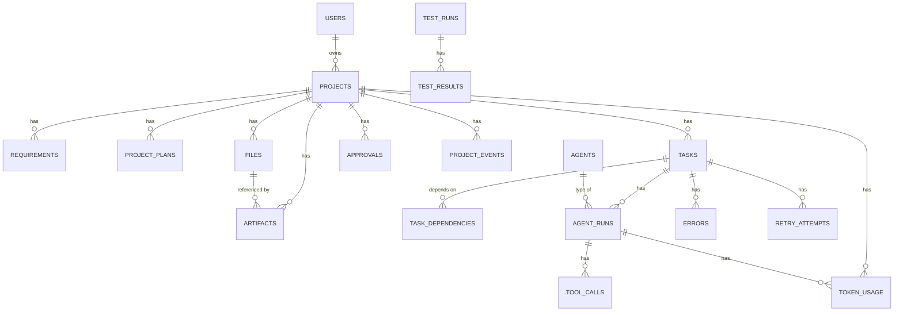

# 14 - Database Design

## Entity overview

18 tables (down from the 20 named in the project brief - two intentional consolidations
below), every one with a UUID primary key and `created_at`/`updated_at` via
`TimestampMixin` (`app/db/base.py`).

## The two consolidations, and why

**No separate `model_usage` table.** It would only ever hold an aggregation of
`token_usage` grouped by model - storing that as a second, separately-maintained table
creates a write path that can drift from the source rows. `token_service.get_project_metrics`
computes it as a query instead (`ModelUsageAggregate`, grouped in Python after one `SELECT`
over `token_usage`). One source of truth for every token/cost number in the system.

**"git diff" needs no git.** `artifacts.file_id` + a file's own `version` column is enough
to reconstruct any historical state; `FileDiffTool` diffs two versions with `difflib`
directly. See [10-tool-system.md](10-tool-system.md).

## Cross-dialect UUIDs

Every primary key and foreign key uses `app/db/types.py::GUID`, a `TypeDecorator` that
renders as native `UUID` on PostgreSQL and as a `CHAR(32)` hex string on SQLite. This
exists because the test suite runs against an in-memory SQLite database
(`backend/tests/conftest.py`) rather than a live Postgres instance, and
`sqlalchemy.dialects.postgresql.UUID` has no SQLite equivalent - using it directly (an
earlier version of this codebase did) would make every model uninstantiable outside
Postgres, silently forcing every test to need a live database.

## Files are versioned, not overwritten

`files.path` + `files.version` is unique per project (`uq_file_path_version`); a write
never mutates an existing row, it inserts a new version. This is what makes `file_diff`
possible without git, what lets `created_by_task_id` attribute a specific version to the
task that wrote it (used by [06-context-engineering.md](06-context-engineering.md) to find
"files my dependencies just produced"), and what the sandbox's `Workspace.materialize()`
reads from to build a container's filesystem.

## Migrations

The initial migration (`alembic/versions/0001_initial_schema.py`) calls
`Base.metadata.create_all()`/`drop_all()` rather than hand-transcribing every column,
because no live Postgres connection was available to run `alembic revision
--autogenerate` while building this repository - and hand-transcribing ~150 columns
across 18 tables is exactly the kind of mechanical transcription that silently drifts
from the real models over time. Generating DDL from the same `Base.metadata` the
application imports means the schema can never diverge from `app/models`. After the first
real deploy, running `alembic revision --autogenerate` should produce an empty diff; if it
doesn't, that's a signal worth investigating, not expected noise.
